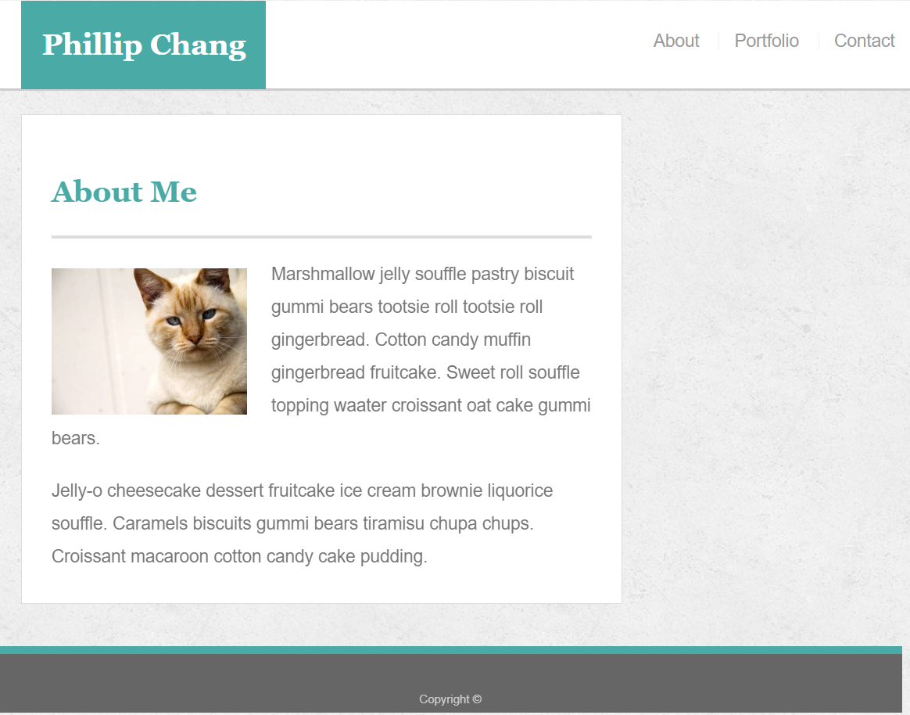
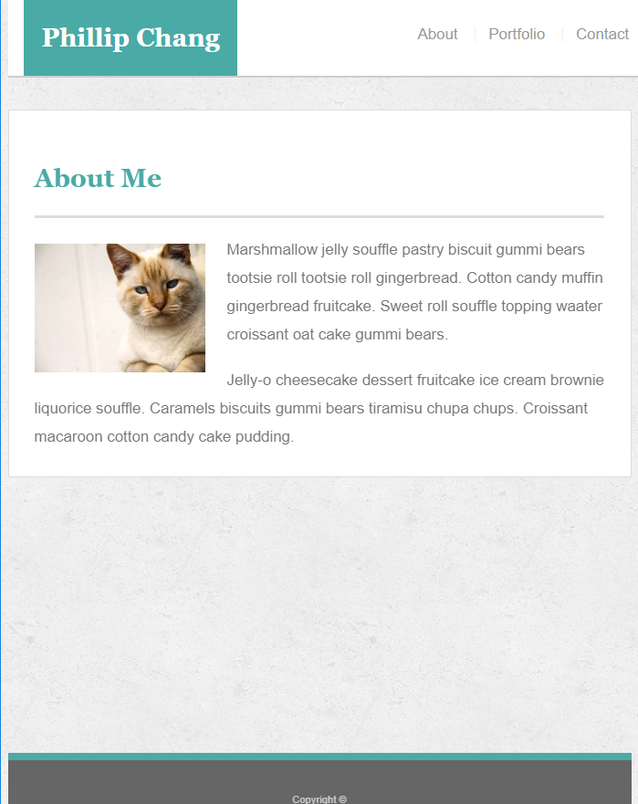
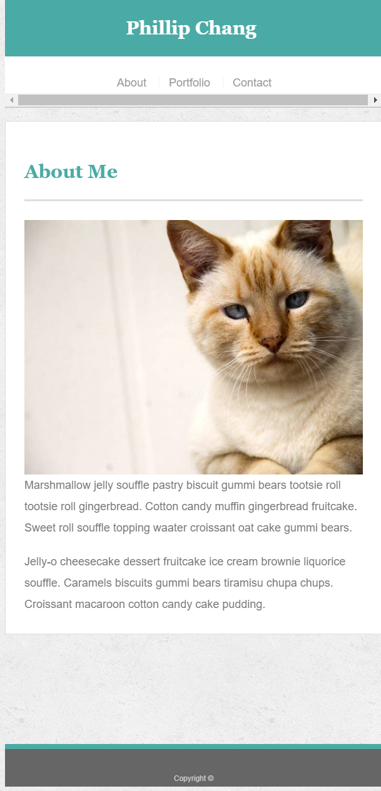
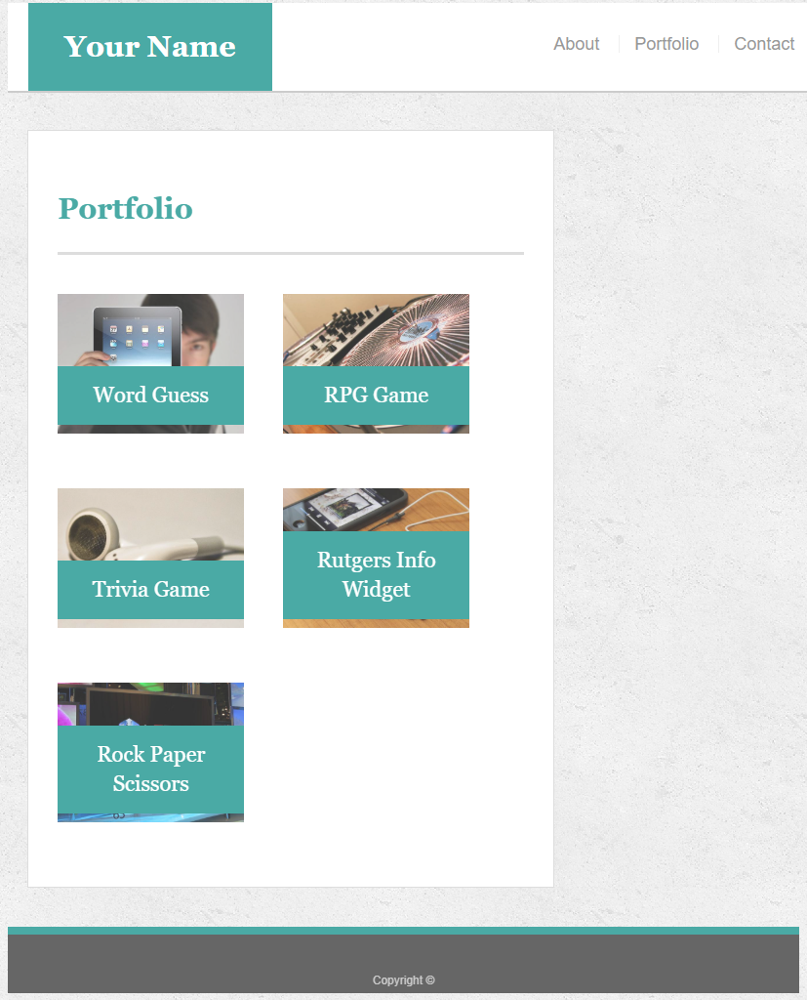
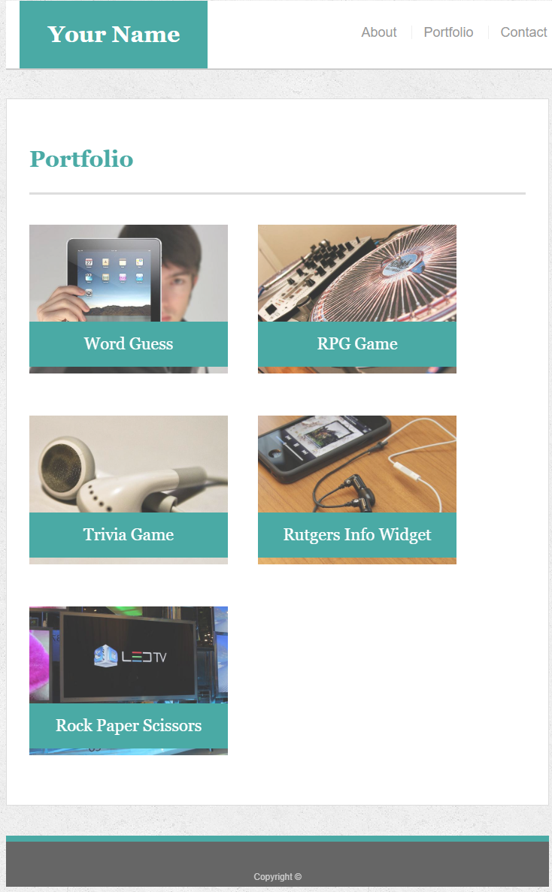
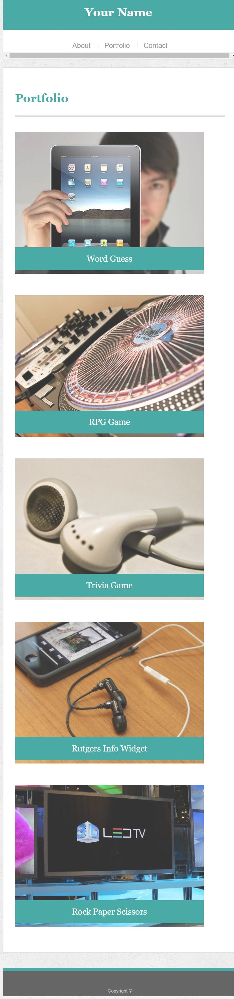
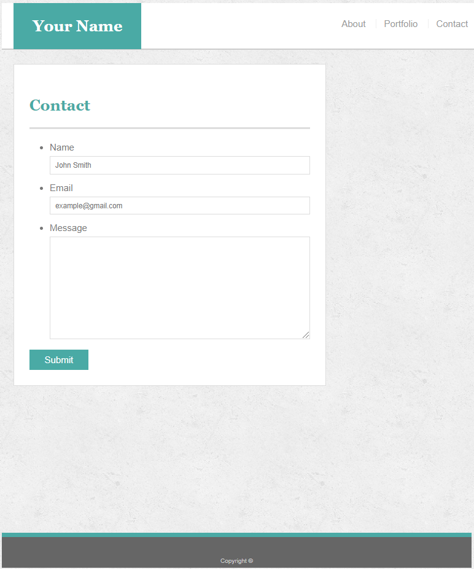
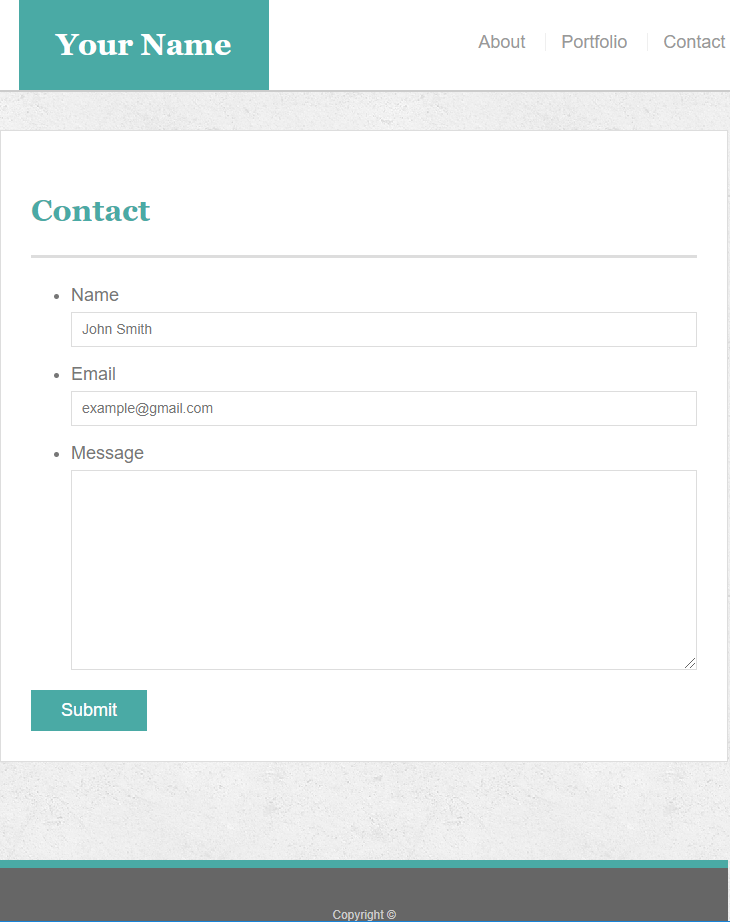
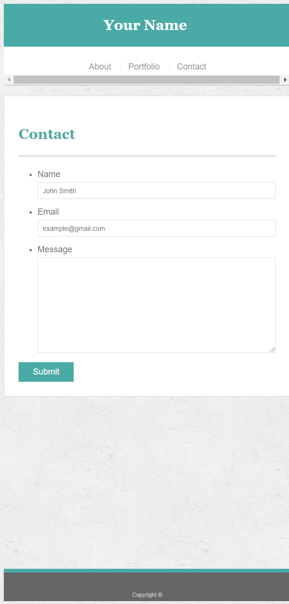

# Responsive-Portfolio

## Index Page 980px

## Index Page 768px

## Index Page 640px

## Portfolio Page 980px

## Portfolio Page 768px

## Portfolio Page 640px

## Contact Page 980px

## Contact Page 768px

## Contact Page 640px

## Description

Creating a simple website and making each page responsive to three types of resolutions (980px,768px,640px).

# Technologies Used

* HTML
* CSS
* Chrome Inspector Dev Tool

# Author

Phillip Chang